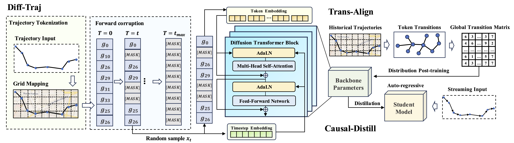

# D2TAD: Robust Trajectory Anomaly Detection on Incomplete Data via Discrete Diffusion Modeling

D2TAD is a discrete diffusion framework for robust trajectory anomaly detection under incomplete observations. Instead of explicitly imputing missing trajectory points, D2TAD directly models incomplete trajectories by treating missing observations as intrinsic absorbing states in a discrete diffusion process. The framework consists of three key components: (i) Traj-Diff, which learns missing-aware spatio-temporal trajectory distributions and derives anomaly evidence from first-step denoising; (ii) Trans-Align, which refines the recovery distribution with empirical transition knowledge to preserve spatially feasible local movements; and (iii) Causal-Distill, which distills the bidirectional diffusion model into an auto-regressive causal student for efficient online anomaly detection.

Extensive experiments on two real-world taxi trajectory datasets demonstrate that D2TAD consistently outperforms state-of-the-art baselines under diverse missing patterns, missing ratios, and anomaly types. On average, D2TAD achieves a 38.8% PR-AUC improvement over the strongest baseline and enables up to 9.5× faster online inference.



<!--The submission keeps:

- Base SEDD/DDiT model.
- `absorb` and `uniform` token graphs.
- Main training.
- Step-0 mask GRPO with empirical transition reward.
- Autoregressive distillation and online student evaluation.
- Anomaly detection scoring.
- Porto and Chengdu preprocessing.
- Four missing-data variants: `SR-TR`, `SR-TC`, `SC-TR`, `SC-TC`.

The submission removes distance graph diffusion, graph embedding priors, temporal conditioning priors, aggregated graph construction, and experiment outputs.-->

## Environment

- CUDA = 11.8

```bash
pip install -r requirements.txt
```

## Code Structure

```text
D2TAD/
├── README.md                                   # Official README
├── requirements.txt                            # Pinned pip dependencies
├── train.py                                    # Hydra entry for discrete diffusion training
├── run_train.py                                # Main training loop for the base diffusion model
├── run_detection.py                            # Offline logrank anomaly detection
├── train_step0_grpo_mask.py                    # Step-0 GRPO fine-tuning with transition reward
├── train_autoregressive_distill.py             # Causal-Distill student training
├── run_causal_student_online_eval.py           # Online anomaly detection with the causal student
├── load_model.py                               # Checkpoint and config loading helpers
├── data.py                                     # Trajectory dataset loading and token handling
├── graph_lib.py                                # Absorbing and uniform token graph definitions
├── noise_lib.py                                # Diffusion noise schedules
├── losses.py                                   # Discrete diffusion training losses
├── sampling.py                                 # Sampling utilities
├── catsample.py                                # Categorical sampling helpers
├── utils.py                                    # Config, logging, and general utilities
├── figures/
│   └── framework.png                           # README framework figure
├── configs/                                    # Hydra configuration files
│   ├── config.yaml                             # Main experiment configuration
│   └── model/default.yaml                      # Default 1024-dim / 12-block model configuration
├── model/                                      # Discrete diffusion model implementation
│   ├── transformer.py                          # Backbone architecture
│   ├── rotary.py                               # Rotary embedding utilities
│   ├── fused_add_dropout_scale.py              # Fused layer helpers
│   ├── ema.py                                  # Exponential moving average helper
│   └── utils.py                                # Model utilities
├── preprocessing/                              # Dataset preprocessing and missing-data construction
│   ├── preprocess_porto.py                     # Porto CSV preprocessing
│   ├── preprocess_chengdu.py                   # Chengdu CSV preprocessing
│   ├── preprocess_utils.py                     # Shared preprocessing helpers
│   ├── generate_anomaly_datasets.py            # Detour / switch anomaly construction
│   └── generate_missing_datasets.py            # SR-TR / SR-TC / SC-TR / SC-TC construction
└── scripts/
│   └── build_transition_prob_dense.py          # Empirical transition matrix construction for GRPO
```

## Datasets

The Porto and Chengdu datasets can be downloaded following the links in the [MST-OATD repository](https://github.com/chwang0721/MST-OATD.git).

## Preprocessing

- Porto:

```bash
python preprocessing/preprocess_porto.py \
  --input_csv /path/to/porto.csv \
  --output_dir data/porto
```

- Chengdu:

```bash
python preprocessing/preprocess_chengdu.py \
  --input_dir /path/to/chengdu/raw_csvs \
  --output_dir data/chengdu
```

- Anomaly Generation

```bash
python preprocessing/generate_anomaly_datasets.py \
  --dataset_name porto \
  --input_file data/porto/test_data_init.npy \
  --target_dir data/porto_anomaly
```

This command generates both detour and switch anomaly datasets by default, following the settings used in our paper. 

- Missing Data Generation

Generate the four missing-data variants for detour:

```bash
python preprocessing/generate_missing_datasets.py \
  --dataset_name porto \
  --input_file data/porto_anomaly/outliers_data_detour_a0.1_d3_nomiss.npy \
  --target_dir data/porto_anomaly_missing \
  --output_prefix outliers_data_detour_a0.1_d3 \
  --outlier_ids_file data/porto_anomaly/outliers_idx_detour_a0.1_d3.npy
```

Generate the four missing-data variants for switch:

```bash
python preprocessing/generate_missing_datasets.py \
  --dataset_name porto \
  --input_file data/porto_anomaly/outliers_data_switch_a0.3_d3_nomiss.npy \
  --target_dir data/porto_anomaly_missing \
  --output_prefix outliers_data_switch_a0.3_d3 \
  --outlier_ids_file data/porto_anomaly/outliers_idx_switch_a0.3_d3.npy
```

`generate_missing_datasets.py` creates `SR-TR`, `SR-TC`, `SC-TR`, and `SC-TC` by default at missing rates `0.1`, `0.3`, `0.5`, `0.7`, and `0.9`.

## Discrete Diffusion Model Training 

```bash
python train.py data.dataset_name=porto graph.type=absorb ngpus=1
```

## Post-Training

- Build Transition Matrix

GRPO uses an empirical transition matrix:

```bash
python scripts/build_transition_prob_dense.py \
  --dataset_path data/porto/train_data_init.npy \
  --num_tokens 6190 \
  --ignore_tokens 6188,6189 \
  --output_path data/porto/transitions.pt
```

- GRPO Training

```bash
python train_step0_grpo_mask.py \
  --base_model_path outputs/porto/RUN_DIR/checkpoints/checkpoint_10.pth \
  --dataset_path data/porto/train_data_init.npy \
  --reward_transition_path data/porto/transitions.pt
```

Use `--num_tokens 10754 --ignore_tokens 10753,10752` for Chengdu.

## Offline Detection

```bash
python run_detection.py \
  --model_path outputs/porto/RUN_DIR/checkpoints/checkpoint_10.pth \
  --dataset_path data/porto/test_data_init.npy \
  --outlier_ids_path data/porto/outlier_ids.npy \
  --output_csv detection_scores.csv \
  --mask_ratio 0.25 \
  --topk_ratio 0.05
```

## Auto-regressive Distillation

```bash
python train_autoregressive_distill.py \
  --teacher_model_path outputs/porto/RUN_DIR/checkpoints/checkpoint_10.pth \
  --output_dir outputs/porto_distill
```

## Online Detection:

```bash
python run_causal_student_online_eval.py \
  --student_ckpt outputs/porto_distill/checkpoints/student_step_500.pth \
  --dataset_path data/porto/test_data_init.npy
```
